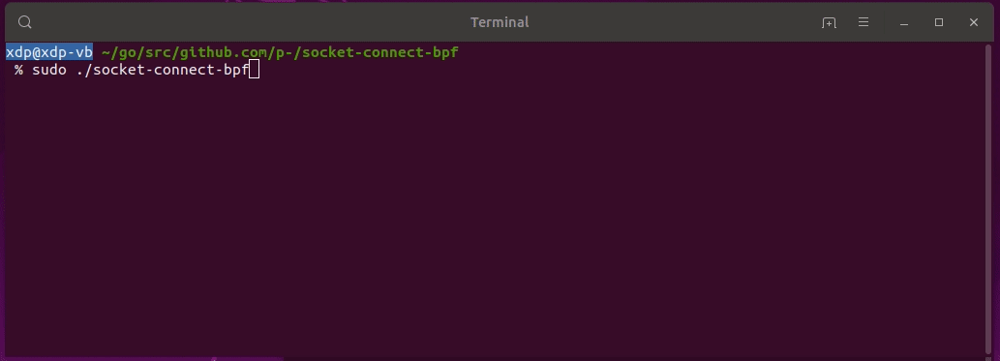

# socket-connect-bpf

socket-connect-bpf is a Linux command line utility that writes human-readable information about each application that makes new (network) connections to the standard output.

More [sample output](samples/socket-connect-bpf-example.txt).

## Details
socket-connect-bpf is a BPF/eBPF prototype with a kernel probe attached to [`security_socket_connect`](https://github.com/torvalds/linux/blob/master/include/linux/security.h). Connections to AF_UNSPEC and AF_UNIX are explicitly excluded. 

To resolve IP addresses to hostnames a user probe to `getaddrinfo` is used.

Following information about each request is displayed if possible:

| Name          | Description                                              | Sample           |
| --------------|----------------------------------------------------------|------------------|
| Time          | Time at which the connection event was received.         | 17:15:58         |
| AF            | Address family                                           | AF_INET          |
| PID           | Process ID of the process making the request.            | 8549             |
| Process       | Process path of the process making the request.          | /usr/bin/curl    |
| User          | Username under which the process is executed.            | root             |
| Destination   | IP address and port of the destination.                  | 127.0.0.53:53    |
| Host          | Hostname (if cached)                                     | github.com       |
| AS-Info       | Info about the autonomous system (AS) of the IP address. | AS36459 (GITHUB) |

## Use cases

You might want to try `socket-connect-bpf` for the following use cases:

* Check if an application contains analytics.
* Check if your trusted dependencies communicate with the outside world.
* As a less invasive alternative to Kernel modules that provide the same functionality.

## License
The socket-connect-bpf Go code is licensed under the Apache License. The BPF code is licensed under GPL as some [BPF-helpers are GPL-only](https://github.com/iovisor/bcc/blob/master/docs/kernel-versions.md#helpers).

## Requirements
* x64 CPU(s)
* Recent Linux Kernel: 4.15 or later
* [Go](https://golang.org/)
* upstream [bpfcc-tools](https://github.com/iovisor/bcc/blob/master/INSTALL.md#ubuntu---binary)

## Installation
Step-by-Step instructions for Ubuntu 18.04.2 with Linux Kernel 4.18.

    # Install Go (if not already installed)
    sudo apt install golang-go

    # Install Upstream BCC Tools for Ubuntu 18.04 (Bionic Beaver)
    sudo apt-key adv --keyserver keyserver.ubuntu.com --recv-keys 4052245BD4284CDD
    echo "deb https://repo.iovisor.org/apt/$(lsb_release -cs) $(lsb_release -cs) main" | sudo tee /etc/apt/sources.list.d/iovisor.list
    sudo apt update
    sudo apt install bcc-tools libbcc-examples linux-headers-$(uname -r)

    # Get dependencies
    go get github.com/iovisor/gobpf

    # Get socket-connect-bpf
    go get github.com/p-/socket-connect-bpf

    # Ignore the warning...

    cd ~/go/src/github.com/p-/socket-connect-bpf/

    go generate
    go build

## Running:

    sudo ./socket-connect-bpf

### Autonomous System (AS) Information

Information about an autonomous system (AS) that an IP address belongs to is not displayed by default.
It can be turned on with the flag `-a`.

    sudo ./socket-connect-bpf -a

AS Data of [IPtoASN](https://iptoasn.com/) is used.
The local AS-Number lookup will require some more RAM.

## Development

### Tests
Run tests:

    go test ./...

### IDE
[VS Code](https://code.visualstudio.com/) can be used for development. The committed `settings.json` file highlights `*.bpf` files as C files.
